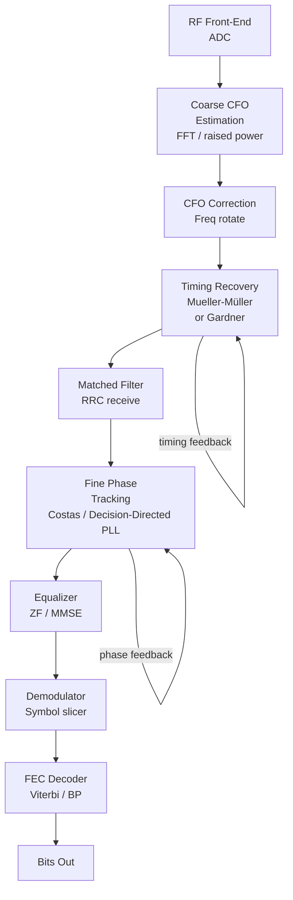

# Carrier & Clock Synchronization

## 10.1 The Synchronization Problem

A real receiver never knows the transmitter's exact carrier phase, carrier frequency, or symbol timing. Three offsets must be estimated and corrected:

```
Transmitted:    s(t) = A · cos(2πfc·t + φ₀)          (known at TX)
Received:       r(t) = A · cos(2π(fc + Δf)·t + φ₀ + φ_err) + noise

Δf  = carrier frequency offset (CFO)   ← Doppler, oscillator mismatch
φ_err = carrier phase offset            ← random initial phase
t_err = timing offset                   ← when to sample symbols
```

If not corrected:
- **Phase offset** → rotates the constellation → wrong symbols
- **Frequency offset** → constellation spins → all symbols wrong
- **Timing offset** → samples between symbols → heavy ISI

---

## 10.2 Phase-Locked Loop (PLL)

The PLL is a **feedback control system** that tracks an oscillating signal's phase.

```
┌────────────────────────────────── PLL ──────────────────────────────┐
│                                                                      │
│  Input x(t) ──► Phase Detector ──► Loop Filter ──► VCO ──► θ̂(t)   │
│  (ref. signal)     (PD)              F(s)           ↑               │
│                      │                              │               │
│                      └─────────── feedback ─────────┘               │
└──────────────────────────────────────────────────────────────────────┘

PD output:   e(t) = sin(θ_in(t) − θ̂(t)) ≈ θ_in − θ̂  (for small error)
Loop filter: F(s) = (1 + s·τ₂) / (s·τ₁)   (2nd-order, eliminates freq offset)
VCO:         θ̂(t) = ∫ v(t) dt   (integrator — converts control voltage to phase)
```

**2nd-order PLL parameters:**

```
Natural frequency:   ωn = √(Kd · Ko / τ₁)
Damping ratio:       ζ  = (ωn · τ₂) / 2

Critically damped:   ζ = 1/√2 ≈ 0.707  (recommended)

Lock-in range:   Δω_L ≈ ωn  (pulls in from this initial offset)
Pull-in range:   Δω_P ≈ π/2 · Kd · Ko  (ultimate capture range)
```

**Digital implementation (from `src/synchronisation/pll.py`):**

```python
# Discrete-time 2nd-order PLL
α = 2·ζ·ωn·Ts        # proportional gain
β = (ωn·Ts)²         # integral gain

# Each sample:
e[n] = phase_detector_output(x[n], θ̂[n])
θ̂[n+1] = θ̂[n] + α·e[n] + β·Σe[k]    (PI controller + VCO)
```

---

## 10.3 Costas Loop (Carrier Recovery for BPSK)

A modified PLL that extracts carrier phase **without knowing the data** — "blind" phase estimation.

```
                ┌─────────────── Costas Loop ──────────────────┐
                │                                              │
r(t) ──┬──[× cos(θ̂)]──[LPF]──► I(t) = A·cos(Δφ)·d(t)        │
       │                                    │                  │
       │                               [sgn(·)]               │
       │                                    │                  │
       │                                    [×]──► e(t)        │
       │                                    │         │        │
       └──[× −sin(θ̂)]──[LPF]──► Q(t) = A·sin(Δφ)·d(t)  ──────┘
                                                   ↓
                                            [Loop Filter]
                                                   ↓
                                              NCO → θ̂

Phase error signal:
e(t) = I(t) · Q(t) = A²·cos(Δφ)·sin(Δφ)·d²(t) = (A²/2)·sin(2Δφ)·d²(t)

Since d(t) = ±1: d²(t) = 1 → e(t) = (A²/2)·sin(2Δφ)

S-curve:  e vs Δφ → stable equilibrium at Δφ = 0, π  (BPSK ambiguity!)
```

**For QPSK Costas loop:**

```
e(t) = sign(I) · Q − sign(Q) · I     (4-phase S-curve)
```

---

## 10.4 Mueller-Müller Symbol Timing Recovery

After matched filtering, symbols must be sampled at the **correct instant**. M&M operates at 2 samples per symbol and adjusts the sampling clock.

```
At 2× oversampling:
  y[2n]   = sample at current timing estimate
  y[2n−1] = sample one half-symbol earlier

Decision-directed error:
  e[n] = (y[2n−1] − y[2n+1]) · D[n] − (D[n−1] − D[n+1]) · y[2n]

where D[n] = sliced decision (sign of y[2n])

Simplified version:
  e[n] = y[n−1] · D[n] − y[n] · D[n−1]

e > 0: sampling too late → advance clock
e < 0: sampling too early → retard clock
```

**Timing recovery loop:**

```
Symbol rate input y[n] ──[M&M Error Detector]──► e[n]
                                                     │
                                              [Loop Filter]
                                                     │
                                              [Interpolator]──► y_corrected[m]
                                              (Farrow structure)
```

---

## 10.5 Frequency Offset Estimation

Before a PLL can lock, a coarse frequency estimate is needed.

**Non-data-aided (NDA) frequency estimation for BPSK:**

```
Algorithm: raise signal to 2nd power to remove data modulation
  y²[n] = (A·d[n]·e^{j2π(f_carrier + Δf)n})² = A²·e^{j2π·2Δf·n}

  FFT(y²[n]) → peak at 2Δf → Δf = peak_frequency / 2
```

**QPSK: raise to 4th power:**

```
  y⁴[n] → peak at 4Δf → Δf = peak_frequency / 4
```

**Timing estimation (NDA):**

```
  Gardner algorithm:
  e[n] = Re{y*(n−1/2) · [y(n) − y(n−1)]}

  where y(n−1/2) is the midpoint sample (half-symbol interpolated)
```

---

## 10.6 Complete Synchronization Chain



---

## 10.7 Impact of Synchronization Errors on Constellations

| Error type | Effect on constellation | Recovery |
|------------|------------------------|---------|
| Phase offset Δφ | Rotated by Δφ | PLL / Costas |
| Freq offset Δf | Spinning (time-varying rotation) | CFO correction |
| Timing offset Δt | Smeared / ISI | M&M timing recovery |
| Phase noise | Constellation spread (tangentially) | Soft decisions, FEC |
| Amplitude imbalance | Elliptical spread | AGC |

---

## 10.8 Code Usage

```python
from src.synchronisation.pll import AnalogPLL, CostasLoop, MuellerMuller

# 2nd-order PLL tracking a noisy sine wave
pll = AnalogPLL(loop_bw=0.01, damping=0.707, fs=1000)
phase_estimates = []
for sample in received_signal:
    theta_hat = pll.step(sample)
    phase_estimates.append(theta_hat)

# Costas loop for BPSK carrier recovery
costas = CostasLoop(loop_bw=0.005, fs=8000)
i_out, q_out, phase_track = costas.process(bpsk_signal)

# Mueller-Müller timing recovery (2× oversampled input)
mm = MuellerMuller(mu=0.01, sps=2)
symbols, timing_error = mm.process(matched_filter_output)
```
