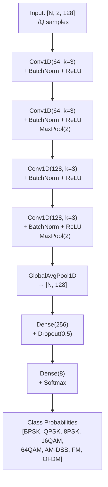

# Automatic Modulation Classification (AMC) with Deep Learning

## 13.1 The Classification Problem

Given a received IQ signal segment of unknown modulation type, identify which of N modulation classes it belongs to — without any pilot overhead or preamble.

```
Input:  128 IQ samples (2 × 128 tensor = I + Q channels)
Output: one of {BPSK, QPSK, 8PSK, 16QAM, 64QAM, AM-DSB, FM, OFDM}

Challenges:
  - Unknown SNR (−10 to +20 dB in practice)
  - Unknown carrier phase / frequency offset
  - Same modulation can look very different at different SNRs
  - FM and OFDM have fundamentally different statistics from PSK/QAM
```

---

## 13.2 IQ Data Representation

A baseband IQ sequence is stored as a 2D array:

```
Shape: [batch, 2, 128]
         │     │   └─ 128 time samples
         │     └───── channel 0 = I (real), channel 1 = Q (imaginary)
         └─────────── batch dimension

Example 16-QAM at high SNR:
  I: [+1, −3, +3, −1, +1, +3, ...]  (one of {±1, ±3})
  Q: [−1, +1, −3, +3, −3, −1, ...]

Example FM at high SNR:
  I: [cos(φ(t))]  (smooth, slowly varying)
  Q: [sin(φ(t))]
```

---

## 13.3 CNN Architecture



**Why 1D convolution on IQ?**

1D Conv over the time axis learns local patterns in I/Q sequences:
- PSK: constant amplitude → circular patterns
- QAM: variable amplitude → amplitude fluctuations in the time domain  
- FM: continuous smooth phase → strongly autocorrelated IQ
- OFDM: many carriers → complex time-domain envelope statistics

---

## 13.4 Feature Extraction: What the CNN Learns

### Layer 1-2 (k=3 convolutions, 64 channels)

```
Input IQ ──[k=3 Conv]──► local phase/amplitude patterns
                         (e.g., "constant amplitude" → PSK indicator)
```

### Layer 3-4 (k=3 convolutions, 128 channels)

```
Mid-level ──[k=3 Conv]──► longer-range patterns
                           (e.g., "symbol transitions" → specific mod)
```

### GlobalAveragePool

```
[N, 128, L] ──► [N, 128]   average over time → aggregate statistics
                             (order statistics, higher-order moments implicitly)
```

---

## 13.5 Synthetic Dataset Generation

Training data is synthesized with controlled SNR:

```python
MODULATIONS = ['BPSK', 'QPSK', '8PSK', '16QAM', '64QAM', 'AM-DSB', 'FM', 'OFDM']

For each sample:
  1. Generate clean IQ signal (128 samples) for a random modulation
  2. Add random carrier phase offset φ ~ U(0, 2π)
  3. Add random frequency offset δf ~ U(−0.1, 0.1) × symbol_rate
  4. Add AWGN at chosen SNR: snr_db ~ U(−10, +20)

Total dataset: 50,000 samples per class × 8 classes = 400,000 samples
```

**Signal generators (per class):**

```
BPSK:   symbols ∈ {+1, −1}, RRC pulse-shaped, 8 sps
QPSK:   symbols ∈ {±1±j}/√2, RRC pulse-shaped
8PSK:   symbols on unit circle at multiples of π/4
16QAM:  4×4 grid of Gray-coded symbols
64QAM:  8×8 grid of Gray-coded symbols
AM-DSB: A(1 + μm(t))cos(2πfct) with sinusoidal message
FM:     exp(j2πkf∫m(τ)dτ) with sinusoidal message
OFDM:   QPSK on 64 subcarriers, IFFT output
```

---

## 13.6 Classification Performance

Typical confusion matrix at various SNRs:

```
High SNR (+20 dB):                Low SNR (0 dB):
  Predicted →                      Predicted →
  B  Q  8  16  64  AM  FM  OF       All predictions scattered
B [99 0  0   0   0   0   0   0]    B [42 12  8  ...] 
Q [ 0 99  1   0   0   0   0   0]   Q [15 38  7  ...]
8 [ 0  1 98   1   0   0   0   0]   ...
16[ 0  0  1  97   2   0   0   0]   Accuracy drops to ~50% at −5 dB
64[ 0  0  0   2  97   0   0   1]
AM[ 0  0  0   0   0  99   1   0]   AM/FM/OFDM remain distinguishable
FM[ 0  0  0   0   0   1  99   0]   because they have distinct envelope stats
OF[ 0  0  0   1   1   0   0  98]   even at low SNR
```

---

## 13.7 Key Signal Statistics Used Implicitly

| Feature | How it distinguishes |
|---------|----------------------|
| Instantaneous amplitude variance | PSK (constant) vs QAM (variable) vs OFDM (high PAPR) |
| Higher-order cumulants C₄₂ | M-PSK vs M-QAM at same order |
| Phase histogram | BPSK: 2 peaks vs QPSK: 4 peaks vs 8PSK: 8 peaks |
| Autocorrelation | FM: high temporal correlation vs PSK: low |
| Spectral kurtosis | OFDM: Gaussian IQ vs single-carrier non-Gaussian |

---

## 13.8 Code Usage

```python
from src.ml_classifier.modulation_classifier import (
    ModulationClassifier, generate_dataset
)
import numpy as np

# Generate training data
X_train, y_train = generate_dataset(
    n_samples_per_class=5000,
    snr_range=(-10, 20),
    n_samples=128
)

# Create and train CNN
clf = ModulationClassifier(n_classes=8, seq_len=128)
clf.train(X_train, y_train, epochs=50, batch_size=256)

# Classify a new signal
iq_segment = np.random.randn(1, 2, 128)  # [batch, channels, time]
probs = clf.predict(iq_segment)          # [1, 8]
pred_class = np.argmax(probs)
print(f"Predicted: {clf.class_names[pred_class]} ({probs[0,pred_class]:.1%})")

# Evaluate accuracy vs SNR
snr_range = np.arange(-10, 25, 2)
accuracy_vs_snr = clf.evaluate_snr_curve(snr_range)
```
