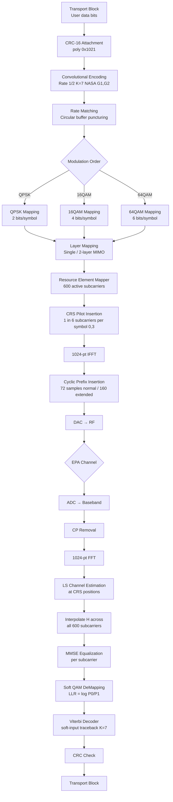

# LTE Downlink Physical Layer Simulator

## 14.1 LTE Physical Layer Overview

LTE (Long-Term Evolution / 4G) defines a complex but highly optimized physical layer. This simulator implements the **PDSCH** (Physical Downlink Shared Channel) — the main data channel.

```
LTE FDD Downlink (10 MHz bandwidth):

  Bandwidth:          10 MHz
  FFT size:           1024
  Subcarrier spacing: 15 kHz
  Active subcarriers: 600  (50 resource blocks × 12 SC/RB)
  CP length (normal): 72 samples
  OFDM symbols/slot:  7
  OFDM symbols/subframe: 14 (2 slots)
  Subframe duration:  1 ms
```

---

## 14.2 Resource Block Structure

```
Frequency domain (subcarriers):
  ◄──────────── 10 MHz bandwidth (1024 subcarriers) ─────────────►
  |..DC guard..|←── 600 active ──────────────────────────────→|..guard..|

  Active subcarriers organized as Resource Blocks (RB):
  ◄─────── 1 RB = 12 subcarriers × 180 kHz ────────►

                    Subcarrier
  ┌──────────────────────────────────────────────────────────────┐
  │ CRS │  D  │  D  │ CRS │  D  │  D  │ CRS │  D  │  D  │ CRS │  Time slot 0, symbol 0
  │  D  │  D  │  D  │  D  │  D  │  D  │  D  │  D  │  D  │  D  │  symbol 1
  │  D  │  D  │  D  │  D  │  D  │  D  │  D  │  D  │  D  │  D  │  symbol 2
  │ CRS │  D  │  D  │ CRS │  D  │  D  │ CRS │  D  │  D  │ CRS │  symbol 3 (pilot row)
  │  D  │  D  │  D  │  D  │  D  │  D  │  D  │  D  │  D  │  D  │  ...
  │  D  │  D  │  D  │  D  │  D  │  D  │  D  │  D  │  D  │  D  │  symbol 6
  └──────────────────────────────────────────────────────────────┘
  CRS = Cell Reference Signal (pilots), D = PDSCH data
```

---

## 14.3 Processing Chain



---

## 14.4 EPA Channel Model

The **Extended Pedestrian A (EPA)** model is a standardized 3GPP multipath profile for urban pedestrian scenarios.

```
EPA tap delays and powers:
  Tap  Delay     Relative Power
  1    0   ns     0.0 dB
  2    30  ns    −1.0 dB
  3    70  ns    −2.0 dB
  4    90  ns    −3.0 dB
  5    110 ns    −8.0 dB
  6    190 ns   −17.2 dB
  7    410 ns   −20.8 dB

Max Doppler: 5 Hz (pedestrian, 3 km/h at 2.6 GHz)

Power delay profile:
  Power (dB)
    0 ─┤●
   −5 ─┤ ●●
  −10 ─┤    ●
  −15 ─┤
  −20 ─┤      ●●
       └──────────── delay (ns)
       0  100  200  300  400
```

---

## 14.5 CRC and Error Detection

CRC-16 provides error detection with generator polynomial 0x1021 (CCITT):

```
G(x) = x¹⁶ + x¹² + x⁵ + 1  (0x1021 in hex)

Process:
  1. Append 16 zero bits to message
  2. XOR divide by G(x)
  3. Remainder (16 bits) = CRC

At receiver:
  1. Re-compute CRC over received message + CRC
  2. If result = 0: no error detected
  3. If result ≠ 0: error detected → request retransmission (HARQ)

Error detection capability: all burst errors ≤ 16 bits detected
```

---

## 14.6 Rate Matching

Adapts the code rate to available resource elements:

```
Available REs = (total subcarriers) − (pilot REs) − (control REs)
Code rate R = (transport block bits + CRC) / (available_REs × bits_per_symbol)

Circular buffer:
  Encoded bits: [systematic | parity 1 | parity 2]
                 └─────────────────────────────────────┐
  Read pointer wraps around: select N_RE bits          ↓ puncture (skip)
                                                        ↓ repeat (re-read)

High code rate: puncture parity bits → faster data rate, less redundancy
Low code rate: repeat bits → more redundancy, higher robustness
```

---

## 14.7 Soft Demodulation (LLR Computation)

Instead of making hard {0,1} decisions, compute **Log-Likelihood Ratios**:

```
LLR = log( P(bit=0 | received signal y) / P(bit=1 | received signal y) )

For AWGN with BPSK:
  LLR = 2y / σ²

For M-QAM (soft max-log approximation):
  LLR_b = (min distance to constellation points with bit=1 in position b)²
         − (min distance to constellation points with bit=0 in position b)²

  all divided by σ²_noise

Advantages of soft decoding:
  - Viterbi with LLR inputs → ~2 dB gain over hard-decision Viterbi
  - Essential for turbo-like iteration between equalizer and decoder
```

---

## 14.8 HARQ (Hybrid ARQ)

LTE uses **Chase Combining** and **Incremental Redundancy (IR)** to retransmit:

```
Transmission 1: send systematic + parity1 bits (redundancy version 0)
  ──→ receiver: decode, if CRC fails, buffer the LLRs

Transmission 2 (retransmission): send same or different parity bits (RV 1,2,3)
  ──→ receiver: combine LLRs with buffer (soft combining)
  MRC gain: SNR improves by ~3 dB per retransmission

Maximum retransmissions: HARQ_max = 4 (typical)
Combining gain makes effective SNR: SNR_eff ≈ N_tx × SNR_per_tx
```

---

## 14.9 Code Usage

```python
from src.lte_simulator.lte_downlink import LTEDownlink

lte = LTEDownlink(
    bandwidth_mhz=10,      # 10 MHz → 1024 FFT, 600 active SC
    modulation='16QAM',    # QPSK / 16QAM / 64QAM
    code_rate=0.5,         # target code rate
    cp_type='normal'       # normal or extended CP
)

# Full downlink simulation
transport_block = np.random.randint(0, 2, 1000)    # 1000 bits
tx_signal = lte.transmit(transport_block)           # OFDM time signal

# Apply EPA channel
rx_signal = lte.apply_epa_channel(tx_signal, snr_db=15)

# Receive
decoded_bits, crc_pass = lte.receive(rx_signal)
if crc_pass:
    ber = np.mean(decoded_bits != transport_block)
    print(f"BER: {ber:.2e}")
else:
    print("CRC failed — retransmit (HARQ)")

# BER sweep
snr_range = np.arange(0, 25, 2)
ber_curve = lte.ber_simulation(snr_range, n_frames=100)
```
