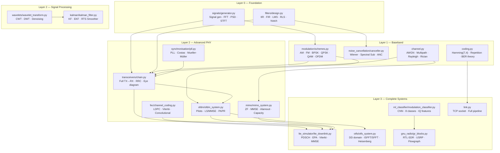
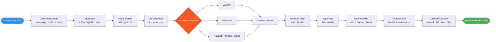
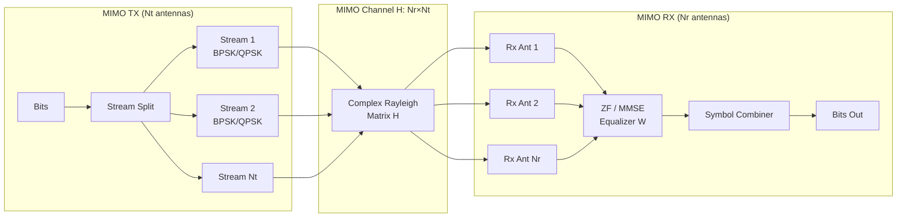
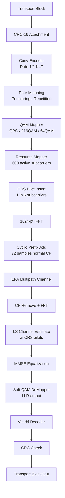

```mermaid
flowchart LR
    subgraph TX["OFDM Transmitter"]
        b[Bits] --> qm[QAM Mapper]
        qm --> pi[Pilot Insert]
        pi --> ifft[N-point IFFT]
        ifft --> cp[+Cyclic Prefix]
        cp --> dac[DAC / RF Up]
    end

    subgraph CH2["Channel"]
        dac --> mpc[Multipath + AWGN]
    end

    subgraph RX["OFDM Receiver"]
        mpc --> adc[ADC / RF Down]
        adc --> rcp[Remove CP]
        rcp --> fft[N-point FFT]
        fft --> ls[LS Channel Est.]
        ls --> mmse[MMSE Equalizer]
        mmse --> dem[QAM DeMapper]
        dem --> ob[Bits Out]
    end
```

# System Architecture & Module Map

## Project Overview

This project implements a complete, layered communications engineering stack in pure Python (NumPy/SciPy). Every formula is coded from first principles — no black-box RF libraries — so you can trace signal transformations at every step.

---

## Module Dependency Map



---

## Data Flow: End-to-End Communication Chain



---

## OFDM Frame Structure (Time-Frequency Grid)

```
Frequency (subcarriers)
  ▲
  │  [P][ ][ ][ ][P][ ][ ][ ][P]  ← Symbol 0 (P = pilot, [ ] = data)
  │  [ ][P][ ][ ][ ][P][ ][ ][ ]  ← Symbol 1
  │  [ ][ ][P][ ][ ][ ][P][ ][ ]  ← Symbol 2
  │  ...
  └──────────────────────────────► Time (OFDM symbols)
       ◄──── OFDM Frame ───────►
```



---

## MIMO Spatial Multiplexing Architecture



---

## LTE Downlink Physical Layer Stack



---

## Module Quick-Reference

| Module | File | Key API |
|--------|------|---------|
| Signal Generator | `src/signals/generator.py` | `sine_wave`, `compute_fft`, `spectrogram` |
| Filter Design | `src/filters/design.py` | `butterworth_lpf`, `lms_filter`, `rls_filter` |
| Modulation | `src/modulation/schemes.py` | `am_modulate`, `qpsk_modulate`, `ofdm_modulate` |
| Noise Cancel | `src/noise_cancellation/canceller.py` | `spectral_subtraction`, `wiener_filter_freq`, `lms_anc` |
| Transceivers | `src/transceivers/chain.py` | `transmitter`, `root_raised_cosine_filter` |
| OFDM | `src/ofdm/ofdm_system.py` | `OFDMSystem.transmit`, `.receive`, `.compute_ber` |
| FEC | `src/fec/channel_coding.py` | `LDPC.encode/decode`, `ConvolutionalCode.viterbi_decode` |
| MIMO | `src/mimo/mimo_system.py` | `zf_equaliser`, `mmse_equaliser`, `alamouti_encode` |
| Sync | `src/synchronisation/pll.py` | `AnalogPLL`, `CostasLoop`, `MuellerMuller` |
| Wavelets | `src/wavelets/wavelet_transform.py` | `cwt_morlet`, `dwt_multilevel`, soft-threshold |
| Kalman | `src/kalman/kalman_filter.py` | `KalmanFilter`, `EKF`, `build_constant_velocity_kf` |
| ML AMC | `src/ml_classifier/modulation_classifier.py` | `generate_dataset`, CNN train/predict |
| GNU Radio | `src/gnu_radio/gr_blocks.py` | `SourceBlock`, `LowPassFilterBlock`, RTL-SDR/USRP |
| LTE | `src/lte_simulator/lte_downlink.py` | `conv_encode`, `viterbi_decode`, PDSCH pipeline |
| OTFS | `src/otfs/otfs_system.py` | `otfs_tx`, `otfs_rx`, `isfft`, `sfft` |
